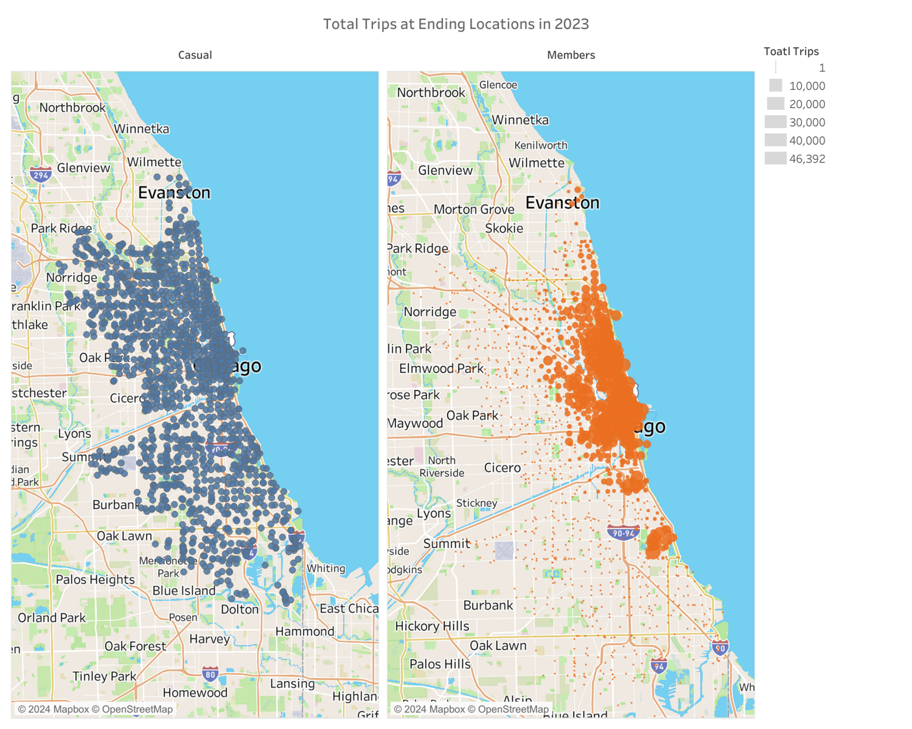

# Cyclistic - A Case Study about  Marketing Bike Sharing Analysis 

In this case study, I will analyze historical data from a Chicago based bike-share company in order to identify trends in how their customers use bikes differently. In order to answer the key business questions, I will follow the steps of the data analysis process: **Ask**, **Prepare**, **Process**, **Analyze**, **Share** and **Act**.The main tools i will use here are **SQL** and **Tableau**. 

## Introduction-
Cyclistic a Bike-Share company in Chicago operates a network of more than 5800 bicycles and 600 docking stations. It offers reclining bikes, hand tricycles and cargo bikes along with traditional bikes. The bikes can be unlocked from one station and returned to any other station in the system anytime. It has flexible pricing plans : Single-ride passes, full-day passes, and annual memberships.Casual riders use single-ride or full-day passes, while cyclistic members use annual membership.

## Scenario-
You are a junior data analyst working on the marketing analyst team at Cyclistic, a bike-share
company in Chicago. The director of marketing believes the company’s future success
depends on maximizing the number of annual memberships. Therefore, your team wants to
understand how casual riders and annual members use Cyclistic bikes differently. From these
insights, your team will design a new marketing strategy to convert casual riders into annual
members. But first, Cyclistic executives must approve your recommendations, so they must be
backed up with compelling data insights and professional data visualizations.

## About the company-
In 2016, Cyclistic launched a successful bike-share offering. Since then, the program has grown
to a fleet of 5,824 bicycles that are geotracked and locked into a network of 692 stations
across Chicago. The bikes can be unlocked from one station and returned to any other station
in the system anytime.

Until now, Cyclistic’s marketing strategy relied on building general awareness and appealing to
broad consumer segments. One approach that helped make these things possible was the
flexibility of its pricing plans: single-ride passes, full-day passes, and annual memberships.
Customers who purchase single-ride or full-day passes are referred to as casual riders.
Customers who purchase annual memberships are Cyclistic members.

Cyclistic’s finance analysts have concluded that annual members are much more profitable
than casual riders. Although the pricing flexibility helps Cyclistic attract more customers,
Moreno believes that maximizing the number of annual members will be key to future growth.
Rather than creating a marketing campaign that targets all-new customers, Moreno believes
there is a solid opportunity to convert casual riders into members. She notes that casual riders
are already aware of the Cyclistic program and have chosen Cyclistic for their mobility needs.

Moreno has set a clear goal: Design marketing strategies aimed at converting casual riders into
annual members. In order to do that, however, the team needs to better understand how
annual members and casual riders differ, why casual riders would buy a membership, and how
digital media could affect their marketing tactics. Moreno and her team are interested in
analyzing the Cyclistic historical bike trip data to identify trends.

## Objectives-
In this case study, our marketing strategy is aiming at converting casual riders into annual riders. To do this, we need to understand how annual members differ from casual riders, why casual riders would buy a annual membership and how digital media could affect their marketing tactics.

In order to answer these questions, we will follow the steps of the data analysis process: **Ask**, **Prepare**, **Process**, **Analyze**, **Share** , and **Act**.

Moreno (The Director of Marketing and Our Manager) has assigned the first question to answer: How do annual members and casual riders use Cyclistic bikes differently?

So, we will produce a report with the following deliverables:
1. A clear statement of the business task
2. A description of all data sources used
3. Documentation of any cleaning or manipulation of data
4. A summary of the analysis
5. Supporting visualizations and key findings
6. Top three recommendations based on the analysis

### Ask

For the Ask step in the Data Analysis Process, we will be required to answer the following questions:

*Guiding questions*

* **What is the problem you are trying to solve?**

   The main objective is to identify **How do Annual Members and Casual Riders use Cyclistic bikes differently?** For that, we will use an historical  bike trips data to analyze and identify trends.

* **How can your insights drive business decisions?**

   The insights derived through this analysis will help to create a marketing stratagy to convert casual riders to cyclistic members.

*Key tasks*

* **Identify the business task**
* **Consider key stakeholders**

*Deliverable*

* **A clear statement of the business task**

   The business task is firstly to identify the behavioural differences between Casual riders and Cyclistic members then to understand how these two groups use cyclistic bikes differently. After that our goal will be to convert Casual riders to Cyclistic members.

### Prepare

In the Prepare Phase, we will be required to answer the following questions:

*Guiding questions*

* **Where is your data located?**

   The data we will use here is Cyclistic historical trip data to analyze and identify trends for year 2023  which can be downloaded from [divvy_tripdata](https://divvy-tripdata.s3.amazonaws.com/index.html). The data has been made available by Motivate International Inc. under this [license](https://divvybikes.com/data-license-agreement).

* **How is the data organized?**

   The 12 files is downloaded in .zip format consisting of file naming convention yyyymm-divvy-tripdata. The available data in these files is organised by month and is stored in a separate .csv file for every month. Each file will give us data information of a month with column names ride_id, rideable_type, started_at, ended_at, start_station_name, start_station_id, end_station_name, end_station_id, start_lat, start_lng, end_lat, end_lng and member_casual.

* **Are there issues with bias or credibility in this data? Does your data ROCCC?**

   There is no issue of biasing in this data as the company collected this data from its clients. So, the credibility is fully accomplished.
Yes, this data is ROCCC as:

   **Reliable:** The data is public that contains accurate, complete and unbiased info on Cyclistic’s historical bike trips.
  
   **Original:** The data is original as it is directly collected from customer by company.
  
   **Comprehensive:** The dataset covers various aspects of data and provides a complete, easily understood and meaningful data.
  
   **Current:** The data is from past 12 months so it is current and continuously updated month to month and it is up-to-date. This is important because the importance of data decreases as time passes.
  
   **Cited:** It is available on many highly reputed websites for data analysis.

* **How are you addressing licensing, privacy, security, and accessibility?**

   This data has been made available by Motivate International Inc. under this license. This is public data  that is accessible and currently updated on Amazon Server. We can use this data to explore how different customer types are using Cyclistic bikes. But the data-privacy issues prohibit you from using riders’ personally identifiable information. This means that you won’t be able to connect pass purchases to credit card numbers to determine if casual riders live in the Cyclistic service area or if they have purchased multiple single passes.

* **How did you verify the data’s integrity?**

   In this dataset, all the files of twelve months have consistent columns and each column has the correct type of data. This will be helpful in cleaning process and in  joining the datasets.

* **How does it help you answer your question?**

   When analyzing data, the analysis will provide valuable insights about customers and their riding style.

* **Are there any problems with the data?**

   At first look, there seems to be no problem with data, but we will see this in next step Process.
But some more information about customers would be helpful, like distance travelled, weather information which will help us to determine how these factors play into the demand for Cyclist’s services.

*Key tasks*

* **Download data and store it appropriately.**
* **Identify how it’s organized.**
* **Sort and filter the data.**
* **Determine the credibility of the data.**

*Deliverable* 

**A description of all data sources used**

The dataset used comprises of 12 monthly datasheets for the entire year of 2023. This data is freely available and can be downloaded in .zip files from an Amazon server for local or cloud storage. It compiles with the ROCCC standards and is unbiased. Additionally, it does not contain any personal or identifiable information, ensuring privacy rights are maintained.

### Process

In this step, we will transform the data to streamline the analyze phase of the process. To do this, we will:
* Check column names for inconsistencies
* Combine all datasets into one dataframe
* Verify the structure of the new dataframe
* Remove all columns not needed for the analysis
* Remove duplicate data
* Add new columns to assist calculations and further analysis

#### Data Combination

SQL Query: [Data Combining](https://github.com/ysonam306/Cyclistic--A-Case-Study-about-Marketing-Bike-Sharing-Analysis/blob/main/01_Data_Combining.Sql)

We have to make sure our data is stored appropriately and prepared for analysis. For this, we have downloaded all 12  zip files and unzipping them, then create a folder on desktop, and also created a subfolder of .CSV files so that we have a copy of original data.

For processing data in BigQuery, some files were uploaded from our desktop folder but for bigger files, i created a bucket in Google Cloud Storage to upload remaining files. Then, these 12 .csv files are uploaded as tables in the dataset ‘2023_tripdata’. After that, we have created another table ‘combined_data’ by using SQL query, and that contains 57,19,877 rows of data for the entire year 2023.

#### Data Exploration

SQL Query: [Data Exploration](https://github.com/ysonam306/Cyclistic--A-Case-Study-about-Marketing-Bike-Sharing-Analysis/blob/main/02_Data_Exploration.Sql)

Before data cleaning, we need to familiarize ourselves with the data to find inconsistencies. So, in this we will check the data type, number of null values  and duplicate rows in all columns. 

**Observations**:
1. The table below shows the all column names and their data types for ‘combined_data’ table. Here, our primary key is ride_id column.
   

2. The below table shows the total number of null values in each column. Note that some columns have same number of null values. This may be due to missing information in the same row i.e. latitude and longitude for the same ending station.
   

3. Now let’s check for duplicate values in ride_id column, as it contains no null values.

There are no duplicate rows in data.   

4. Check for ride_id column character length and it found out for all rows  is 16. So, no need to clean it.
      

5. Check for rideable_bike column- 3 unique type of bikes and their number of trips are shown below.
      

6. The started_at and ended_at columns represents the start and end time of the trip in YYYY-MM-DD hh:mm:ss UTC format. A new column can be created ride_length to find out the total trip duration. Then we have calculated trip duration longer than a day which is 6417 and less than a minute which is 149615. In these rows end time is earlier than start time , so we need to remove them. Other columns day_of_week and month can also be helpful in analysis of trips at different times in a year.   

7. The start_station_name and start_station_id contains number of rows with missing or null values are 875848 which needs to be removed.   

8. The end_station_name and end_station_id contains number of rows with missing or null values are 929343 which needs to be removed.   

9. The end_lat and end_lng contains number of rows with missing or null values are 6990 which needs to be removed.   

10. Check for member_casual columns - 2 unique values as member or casual rider shown below.
   

#### Data Cleaning
SQL Query: [Data Cleaning](https://github.com/ysonam306/Cyclistic--A-Case-Study-about-Marketing-Bike-Sharing-Analysis/blob/main/03_Data_Cleaning.Sql)
1. All the rows having null values are deleted.
2. Three new columns ride_length for total trip duration, day_of_week and month are added.
3. The trips which had duration longer than a day and less than a minute are excluded.
4. Total of 1551377 rows are removed in this step.

Processing the data has enabled us to answer the following questions:

*Guiding questions* 

* **What tools are you choosing and why?**
  
   I have chosen BigQuery for combining the twelve-monthly datasheets into a single-year datasheet because it will allow me to handle huge amount of data and for cleansing, analyzing, and visualization of data in a better manner as compared to spreadsheets.  

* **Have you ensured your data’s integrity?**

   Yes, the data has been thoroughly cleansed and columns datatype remain consistent after joining the files and gotten rid of any inconsistencies and bad data present earlier.

* **What steps have you taken to ensure that your data is clean?**

   First, duplicates have been searched and then removed. Second, NA or missing values would be checked and dealt with them. Third, the decision on dropping incoherent or non-realistic data. Finally, some columns would be removed if not needed to improve the workflow of the datasheet and correspondingly formatted  according to the requirements. A cleaned data frame has been saved to work with it.

* **How can you verify that your data is clean and ready to analyze?**

   The data has been rechecked during the cleaning process and saved as a cleaned_combined_data.csv  file for its manipulation and analysis.

* **Have you documented your cleaning process so you can review and share those results?**

   Yes, the cleaning process is done in BigQuery and comments are added in them to understand the process.

*Key tasks*

* **Check the data for errors.**
* **Choose your tools.**
* **Transform the data so you can work with it effectively.**
* **Document the cleaning process.**

*Deliverable*

**Documentation of any cleaning or manipulation of data**

I am using BigQuery to combine all 12  months dataset into one and then cleaning or manipulation of data. Because it is a big dataset, so cleaning and combining would be difficult in spreadsheets and platform like BigQuery can handle huge amount of data.

The documentation is done at every step via comments in BigQuery. 12 months datasets are combined in one dataset, then duplicates have been removed(if any), null values have been excluded. Then a final .csv file of  cleaned_combined_data has been saved for its further analysis.

### Analyze and Share

In this step of Data Analysis Process, we will try to derive key insights that we have gathered from cleaned data and then will use visualization techniques to get a better understanding of the story that data is trying to tell.

SQL Query: [Data Analysis](https://github.com/ysonam306/Cyclistic--A-Case-Study-about-Marketing-Bike-Sharing-Analysis/blob/main/04_Data_Analysis.Sql)

Data Visualization: [Tableau]()

For the analysis of data, i queried multiple relevant tables and then visualize them in tableau.
The analysis question is: How do annual members and casual riders use Cyclistic bikes differently?

1. Firstly, the members and casual riders are compared by the type of bikes they are using.
 
Members account for 64.3% of the total riders, while casual riders make up the remaining 35.7%. The bike usage chart indicates that classic bikes are the most frequently used, followed by electric bikes. Docked bikes are the least used and are exclusively ridden by casual riders.  

2. Next, the total number of trips distributed by the months, days of the week and hours of the day for 2023 are examined.

**Monthly Trends:** Both casual riders and members exhibit similar seasonal patterns, with increased trips in the spring and summer months and fewer trips in the winter. The number of trips for both groups peaks in July, with the smallest gap between casual and member trips observed during this month.

**Day of the Week Trends:** Casual riders make more trips on weekends, with a noticeable peak on Saturday and Sunday. In contrast, members tend to have consistent trip numbers during weekdays, with a slight decline over the weekend.

**Hourly Patterns:** Members exhibit two peak periods for trips: one in the early morning (around  6 AM to 8 AM), and another in the evening (around 4 PM to 6 PM). In contrast, casual riders’ trips increases steadily throughout the day, peaking in the evening before declining in the evening.              From the previous observations, we can infer that members likely use bikes for commuting to and from work on weekdays, as evidenced by the morning and evening peaks in trips. In contrast, casual riders tend to use bikes throughout the day, with increased activity on weekends, suggesting leisure usage. Both groups are most active during the summer and spring months.  

3. Next, the Ride duration of the trips distributed by months, days of week, and hours of day are compared to find the differences in the behavior of casual and member riders.

**Trends:** 
   * We can see that casual riders tend to cycle longer period of time than members on average. 

   * The duration of average trip for members doesn’t change throughout the year, week, and day. 

   * However, the duration of average trip for casuals vary for year, days of week, and for hour of day. In the spring and summer, on weekends, and from 10 AM to 2 PM during the day, the casual riders tends to cycle longer period of time on average.                                          These findings suggest that casual riders tend to travel longer distances—approximately twice as long—but less frequently than members. They make longer journeys on weekends and during the day outside of commuting hours, particularly in the spring and summer. This pattern indicates that casual riders are likely using bikes primarily for recreational purposes, meaning they use bikes for leisure activities, enjoyment, and exercise, rather than for daily commuting or practical transportation needs.  

4. For the further understanding of that how casual and member riders differ from each other, we have analyzed the location of starting and ending stations with most trips are considered using filters to draw out the following conclusions:

Casual riders mostly started their trips from popular tourist places in the city(for example parks, beach, aquarium, museums etc.), while the members started their trip from stations close to places where they work(restaurents, hospitals,school, bank etc.), study(universities, schools etc.) and residential areas.

A similar trend is observed in the ending station locations. Casual riders tend to conclude their trips near parks, museums, and other recreational sites, indicating leisure activities. In contrast, members often end their trips close to universities, residential areas, and commercial districts, suggesting that they rely on bikes for daily commuting. This pattern reinforces the idea that casual riders use bikes primarily for recreation, while members use them extensively for their everyday transportation needs.

The **Analyze** phase of the process, enables us to answer the following questions:

*Guiding questions*

* **How should you organize your data to perform analysis on it?**

   The data should be combined in one dataset from different datasets, here by combining the 2023 monthly datasheets, which has to be cleaned and manipulated in a way to ensure best possible analysis.

* **Has your data been properly formatted?**

   Yes, each column has the same format or it is ready to be formatted as a convenience during the analysis.

* **What surprises did you discover in the data?**

   The dataset revealed surprising differences in how members use the services compared to casual riders, especially in terms of weekday trends. Additionally, members have a significantly shorter average ride time than casual riders. However, due to the lack of data on distance traveled, it is unclear if this shorter ride time directly correlates with shorter distances.

* **What trends or relationships did you find in the data?**
   1. Members use most bike trips on weekdays in commute hours in spring and summer while casual riders most use bikes at weekends in spring and summer.
   2. Members travel more frequently but for shorter distances than casual riders.
   3. Docked bikes are least preferable rideable type.

* **How will these insights help answer your business questions?**

   The insights derived from the data will enable us to develop a comprehensive profile of riders in 2023, thereby informing strategic marketing decisions and objectives.

*Key tasks*

* **Aggregate your data so it’s useful and accessible.**
* **Organize and format your data.**
* **Perform Calculations.**
* **Identify trends and relationships.**

*Deliverable*

* **A summary of your analysis.**

Summary of both types of riders:

   **Casual Riders:**
   1. Use bikes throughout the day, especially on weekends in summer and spring for leisure.
   2. Travel longer distances but less frequently than members.
   3. Start and end trips near parks, museums, and recreational areas.

   **Members:**
   1. Ride bikes mainly on weekdays during commute hours (around 8 AM and 5 PM) in summer and spring.
   2. Travel more frequently but for shorter distances than casual riders.
   3. Start and end trips near universities, residential areas, and commercial districts.

As we have already performed our analysis and gained some insights about our data and created some visualizations to share our findings. This  **Share** phase of the process, enables us to answer the following questions:

*Guiding questions*

* **Were you able to answer the question of how annual members and casual riders use Cyclistic bikes differently?**

   Yes, the visualizations made from data help us to understand the differences that annual members and casual riders use cyclistic bikes.

* **What story does your data tell?**

   The main story that our data tells is that members follow a set schedule, using the services for routine tasks, which is reflected in their shorter average ride durations compared to casual riders. Members primarily use the services during weekdays, while casual riders are more active on weekends, indicating that casual riders use the service more for leisure activities.

* **How do your findings relate to your original question?**

   In our findings we are comparing annual members and casual rides cyclistic bikes behaviour, and it is our original question.

* **Who is your audience? What is the best way to communicate with them?**

   Our audience is Lily Monreno(The director of marketing and our manager), Cyclistic marketing analytics team and Cyclistic executive team.

   Best way to communicate with them is via 
   1. Visual Presentation which includes Dashboard, chart and graphs etc.
   2. Written Reports which includes summary and detailed analysis.
   3. Interactive tools which includes dashboards, web-applications.
   
   By using best methods to communicate with them, we can effectively share our findings and ensure that the insights are utilized to drive informed decision-making.

* **Can data visualization help you share your findings?**

   Yes, data visualization using Tableau or PowerBi, and by making graphs and charts, we can share our findings with audience.  

* **Is your presentation accessible to your audience?**

   Yes, we can give a presentation to our audience to easily and quickly understand them our findings. 

*Key tasks*

* **Determine the best way to share your findings.**
* **Create effective data visualizations.**
* **Present your findings.**
* **Ensure your work is accessible.**

*Deliverable* 
* **Supporting visualizations and key findings**

   Our supporting visualizations and key findings are already discussed above.

### Act

The act phase of the Data Analysis Process will be taken care of by the marketing team of Cyclist. We need to answer the following questions-

*Guiding questions*

* **What is your final conclusion based on your analysis?**

   The final conclusion from this dataset is that both groups of members make use of the service for different purposes. This difference is evident in the statistics for usage volume during weekends versus weekdays and during peak versus off-peak hours of the day.

* **How could your team and business apply your insights?**

   The insights gained from the data can be used together with a marketing campaign to turn Casual members into Annual members.

* **What next steps would you or your stakeholders take based on your findings?**

   Some improvements can be implemented to know better the rider habits, but by now, the findings can help the marketing team.

* **Is there additional data you could use to expand on your findings?**

   Yes, some features could help to improve the analysis like data on distance traveled and weather information.

*Key tasks*

* **Create your portfolio.**
* **Add your case study.**
* **Practice presenting your case study to a friend or family member.**

*Deliverable*

* **Your top three recommendations based on your analysis**

   1. Caual riders are most active on weekends and during summer and spring, so an Annual Weekend Membership or seasonal membership could convert casual riders into annual members. 
   2. Casual riders use bikes for longer duration of time than annual members. So, discounts for longer rides could encourage both casual riders and members to bike more.
   3. Offer trial memberships, rewards, highlight the benefits of annual membership(like cost savings, priority access to bikes,exclusive offers etc.), loyalty points redeemable for future rides etc. could convert the casual riders to members.
